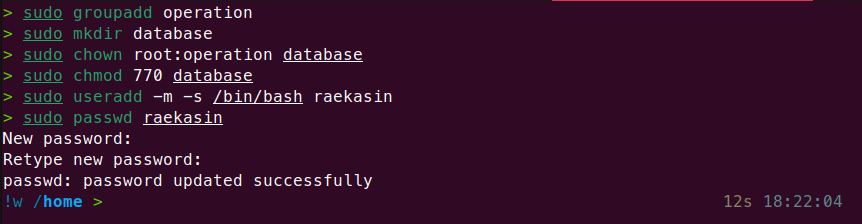
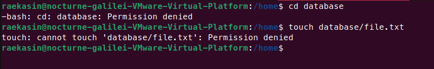
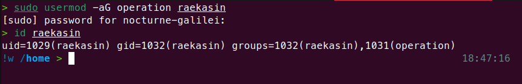
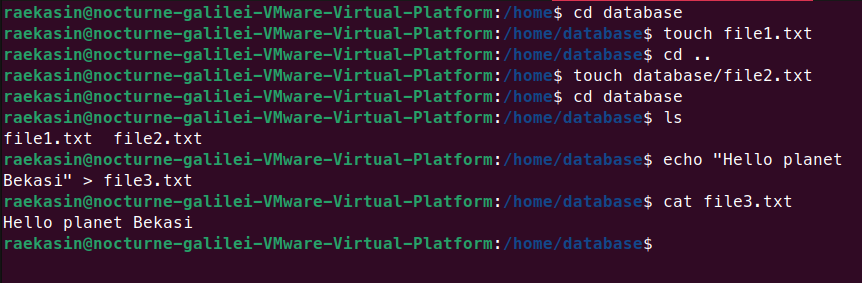

# Incident Response - Permission Denied on Shared Directory


## Objectives
Repository ini berisikan simulasi insiden yang sering terjadi di dunia kerja nyata.
Setiap incident response ditulis dengan struktur berikut:
* **Initial Condition** > Proses pembuatan kondisi dummy incident
* **Symptom** > Notifikasi pesan error di terminal
* **Root Cause** > Penjelasan permasalahan insiden
* **Resolution** > Penjelasan dan proses resolve yang dilakukan
* **Verification** > Verifikasi memastikan insiden sudah teratasi

Dari incident response learning ini diharapkan, saya:
- Mampu menciptakan kondisi salah (dummy incident)
- Memahami permasalahan apa yang terjadi
- Memahami sumber/penyebab insiden
- Mampu melakukan response/resolve dengan benar dan efektif


---


## Environtment
* **Virtual Machines**	: VMware Workstation Pro 25H2
* **OS**		: Ubuntu Desktop ver.24.04
* **Shell**		: Zsh


---


## Incident Case - Permission Denied on Shared Directory
### Initial Condition
Folder/directory `database` untuk kerja tim dimiliki oleh 
user `root` dan group `operation`. User `raekasin` merupakan 
user biasa dan tidak masuk ke group `operation`


### Symptom
Ketika user `raekasin` mengakses folder database, muncul pesan error:


### Root Cause
Permasalahan disebabkan user `raekasin` bukan owner directory
dan tidak termasuk ke dalam group owner `operation`. Sedangkan group
`database` memiliki access permission 0 untuk `other`.

### Troubleshooting
User `raekasin` ditambahkan ke group `operation` agar memiliki akses ke 
folder/directory.
```zsh
sudo usermod -aG operation raekasin
```

> User raekasin perlu relogin

### Verification
Switch user ke `raekasin` dan melakukan proses administrasi seperti masuk, 
membuat file, melihat list directory, melihat isi file ataupun 
execute di dalam directory tersebut.

> Perintah harus berhasil, jika error berarti gagal

