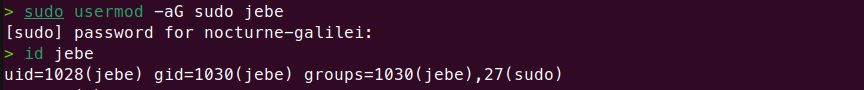
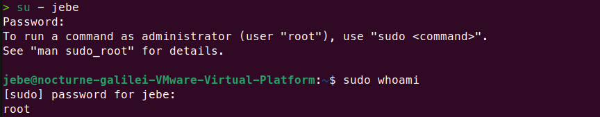

# Incident Response


---


## Objectives
Repository ini berisikan simulasi insiden yang sering terjadi di dunia kerja nyata.
Setiap incident response ditulis dengan struktur berikut:
**Initial Condition** > Proses pembuatan kondisi dummy incident
**Symptom** > Notifikasi pesan error di terminal
**Root Cause** > Penjelasan permasalahan insiden
**Resolution** > Penjelasan dan proses resolve yang dilakukan
**Verification** > Verifikasi memastikan insiden sudah teratasi

Dari incident response learning ini diharapkan, saya:
- Mampu menciptakan kondisi salah (dummy incident)
- Memahami permasalahan apa yang terjadi
- Memahami sumber/penyebab insiden
- Mampu melakukan response/resolve dengan benar dan efektif


---


## Environtment
**Virtual Machines**	: VMware Workstation Pro 25H2
**OS**			: Ubuntu Desktop ver.24.04
**Shell**		: Zsh


---


## Incident Case
### Case 1. User Cannot Run Sudo
#### Initial Condition
Membuat user `jebe` yang bukan owner, tidak masuk di group sudo,
dan tidak masuk di group owner. 


#### Symptom
User `jebe` menjalankan command sudo, kemudian muncul pesan error.


#### Root Cause
User `jebe` tidak bisa melakukan sudo, karena user `jebe` tidak masuk dalam
group `sudo`. Hanya user yang masuk/termasuk di group `sudo` atau `sudoers` yang 
memiliki akses untuk menggunakan command **sudo**

#### Troubleshooting
User `jebe` perlu ditambahkan ke group `sudo` agar memiliki akses untuk
menjalankan perintah `sudo`. 
```zsh
sudo usermod -aG sudo [user]
```

>User `jebe` harus melakukan logout dan login ulang.

#### Verification
Switch user menjadi `jebe`, kemudian verifikasi dengan
```zsh
sudo whoami
```

>jika outputnya **root** maka user `jebe` sudah memiliki akses sudo

